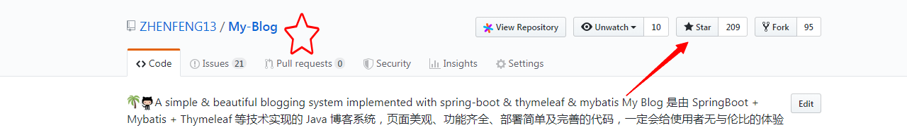
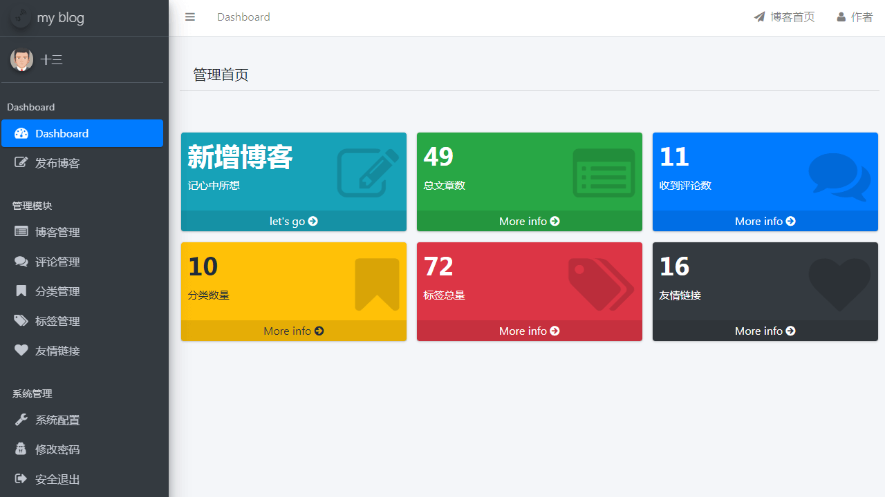
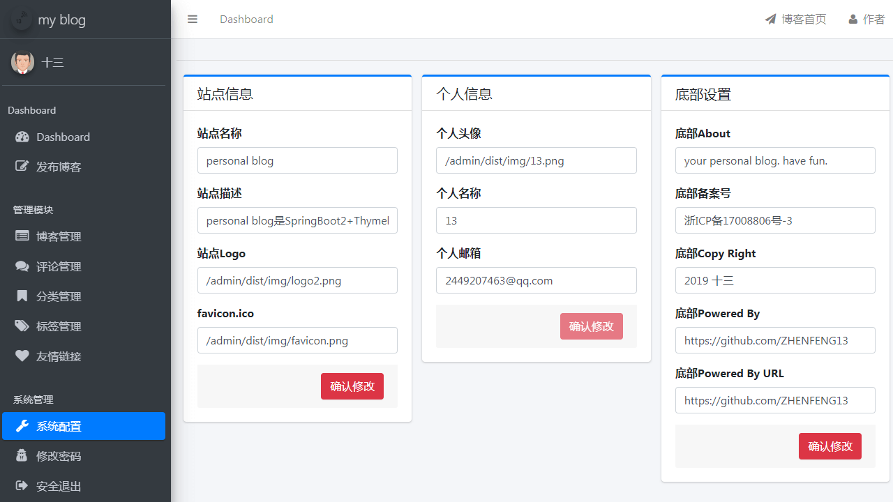
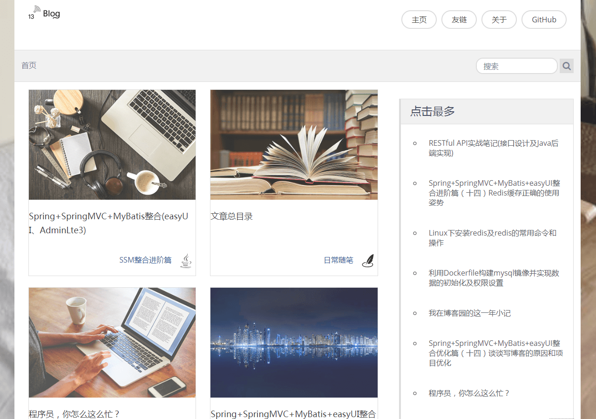

# 写在前面
fork自[十三](https://github.com/ZHENFENG13)的项目，我目前是勇于自己的个人学习使用
原项目地址：[My-Blog](https://github.com/ZHENFENG13/My-Blog)

# My Blog


**坚持不易，各位朋友如果觉得项目还不错的话可以给项目一个 star 吧，也是对我一直更新代码的一种鼓励啦，谢谢各位的支持。**



当前分支的 Spring Boot 版本为 2.7.5，想要学习和使用其它版本可以直接点击下方的分支名称跳转至对应的仓库分支中。

| 分支名称                                                    | Spring Boot Version |
| ------------------------------------------------------------ | ------------------- |
| [spring-boot-2.3.7](https://github.com/ZHENFENG13/My-Blog/tree/spring-boot-2.3.7) | 2.3.7-RELEASE       |
| [main](https://github.com/ZHENFENG13/My-Blog)            | 2.7.5               |
| [spring-boot-3.x](https://github.com/ZHENFENG13/My-Blog/tree/spring-boot-3.x) | 3.0.0       |

- **你可以拿它作为博客模板，因为 My Blog 界面十分美观简洁，满足私人博客的一切要求；**
- **你也可以把它作为 SpringBoot 技术栈的学习项目，My Blog也足够符合要求，且代码和功能完备；**
- **内置三套博客主题模板，主题风格各有千秋，满足大家的选择空间，后续会继续增加，以供大家打造自己的博客；**
- **技术栈新颖且知识点丰富，学习后可以提升大家对于知识的理解和掌握，对于提升你的市场竞争力有一定的帮助。**

## 注意事项

- **数据库文件目录为```static-files/my_blog_db.sql```；**
- **部署后你可以根据自己需求修改版权文案、logo 图片、备案记录等网站基础信息；**
- **My Blog 后台管理系统的默认登陆账号为 admin 默认登陆密码为 123456；**
- **layui 版本的 My-Blog，仓库地址 [My-Blog-layui](https://github.com/ZHENFENG13/My-Blog-layui) ，感兴趣的朋友也可以学习一下；**
- **My Blog 还有一些不完善的地方，鄙人才疏学浅，望见谅；**
- **有任何问题都可以反馈给我，我会尽量完善该项目。**

[](https://travis-ci.org/ZHENFENG13/My-Blog)

[](https://github.com/ZHENFENG13/My-Blog/blob/master/LICENSE)

## 效果预览

### 后台管理页面

- 登录页

	

- 后台首页

	

- 文章管理

	

- 文章编辑

	

- 评论管理

	

- 系统配置

	

### 博客展示页面

开发时，在项目中**内置了三套博客主题模板，主题风格各有千秋**，效果如下：

#### 模板一

- 首页

	

- 文章浏览

	

- 友情链接

	

#### 模板二

- 首页

	

- 文章浏览

	

- 友情链接

	

#### 模板三

- 首页

  

- 文章浏览

  

- 友情链接

  
  
## 感谢

- [spring-projects](https://github.com/spring-projects/spring-boot)
- [ColorlibHQ](https://github.com/ColorlibHQ/AdminLTE)
- [tonytomov](https://github.com/tonytomov/jqGrid)
- [pandao](https://github.com/pandao/editor.md)
- [DONGChuan](https://github.com/DONGChuan/Yummy-Jekyll)
- [zjhch123](https://github.com/zjhch123/solo-skin-amaze)
- [t4t5](https://github.com/t4t5/sweetalert)
